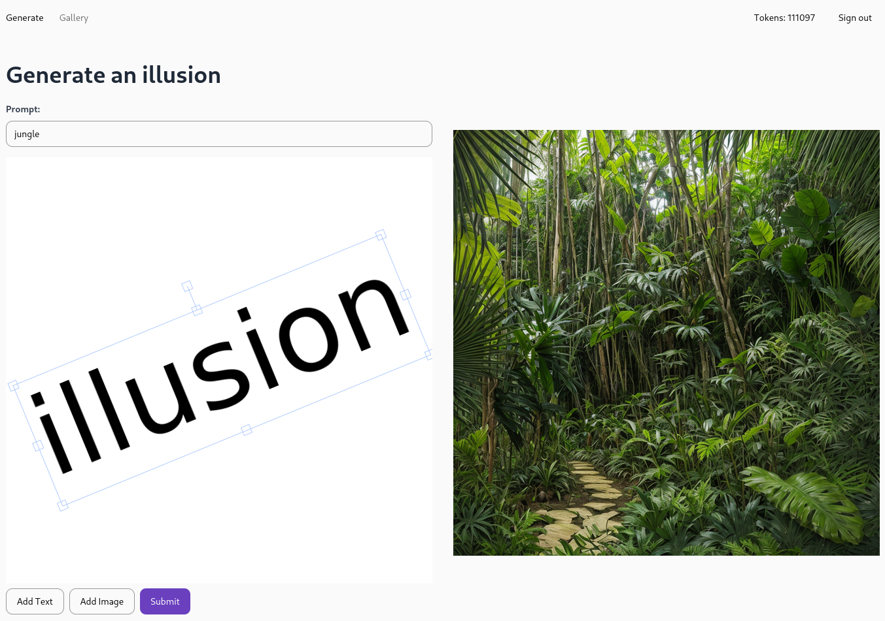
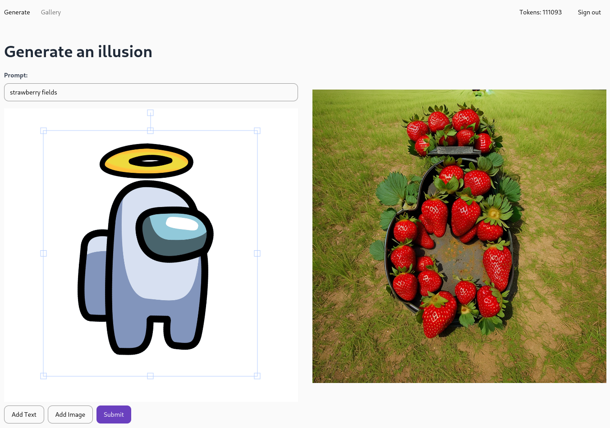

# IlluGens

IlluGens is a website that allows users to generate Stable Diffusion images that have an illusion baked into them. Users can place text or images in a canvas which is then used as a "stencil" for the illusion that is generated.

## Running locally

Note: You will need to have Docker and Docker Compose installed.

To run, use the command `docker-compose up -d`

## Example generations

Note: It is easier to see the illusions if you squint or stand further from your monitor.

Example of a text illusion:

Example of an image-based illusion:
